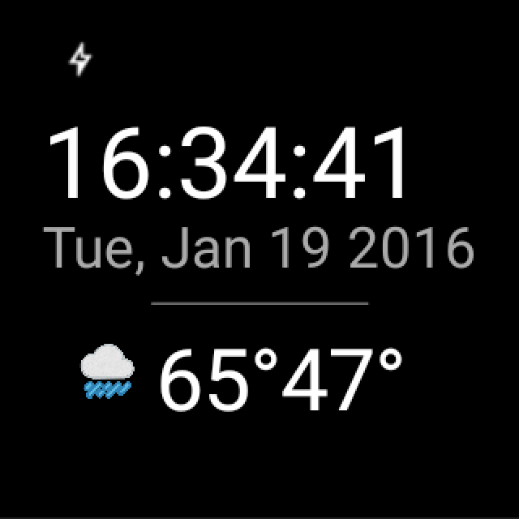

##Weather App - Watch Face

Built a wearable watch face for Sunshine (weather app) to run on an Android Wear device. Sunshine app was a course project used in the Udacity Advanced Android course. 

##Purpose of the project
- Understand the fundamentals of Android Wear.
- Design for multiple watch form factors.
- Communicate between a mobile device and a wearable device.

##How to install and run it
Sunshine app synchronizes weather information from OpenWeatherMap on Android Phones and Tablets. You will need open weather map API key to run the project. You need to update following section with your key in app module's build.gradle file.

buildTypes.each {
        it.buildConfigField 'String', 'OPEN_WEATHER_MAP_API_KEY', '"xxxxxx"'
    }
    
    

    
    

